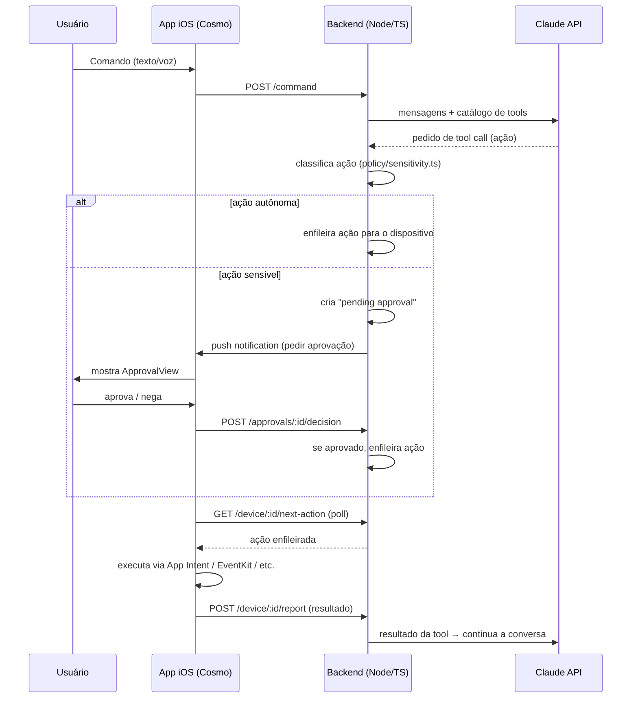

# Arquitetura

## Componentes

### Backend (`backend/`)

- `agent/orchestrator.ts` — chama a API do Claude com o histórico da
  conversa e o catálogo de tools; interpreta as `tool_use` que o modelo
  retorna.
- `agent/tools.ts` — catálogo de ações possíveis (schema JSON de cada tool),
  espelhando o que o app iOS de fato consegue executar.
- `policy/sensitivity.ts` — classifica cada ação como `auto` ou
  `approval_required`, seguindo `docs/POLICY.md`.
- `approval/approvalStore.ts` — fila em memória de aprovações pendentes por
  dispositivo.
- `approval/push.ts` — envio de push via APNs (HTTP/2 + provider token JWT
  ES256); precisa da chave `.p8` da Apple nas variáveis `APNS_*`. Sem elas,
  cai num modo stub que só loga.
- `store/deviceQueue.ts` — fila de ações prontas para o app executar.
- `store/sessionStore.ts` — histórico de conversa por usuário/dispositivo.
- `routes/` — API HTTP consumida pelo app.

### App iOS (`ios-app/`)

- `Intents/` — `AppIntent`s que a Siri/Atalhos conseguem invocar e que o
  próprio Cosmo executa ao receber uma ação do backend.
- `Networking/BackendClient.swift` — chama a API do backend.
- `Networking/PushHandler.swift` — recebe a push de aprovação (que vem com
  `content-available`), acorda o app em background, busca a próxima ação
  (`GET /device/:id/next-action`).
- `Approval/ApprovalView.swift` — tela de confirmação para ações sensíveis.
- `Intents/ActionExecutor.swift` — despacha a ação recebida do backend para
  o `AppIntent`/API correspondente.

## Roadmap para ampliar o que é "autônomo"

Como o iOS não permite automação de UI de terceiros, cobrir mais serviços
(WhatsApp, Instagram, Amazon, etc.) exige integrar as **APIs oficiais** de
cada um deles como novas tools no backend — não simular toques na tela. Cada
nova integração:

1. Vira uma tool nova em `agent/tools.ts`.
2. É classificada em `policy/sensitivity.ts`.
3. Se precisar rodar algo no dispositivo (não só numa API externa), ganha um
   `AppIntent` correspondente no app iOS.

## Por que não usar Accessibility Service / ADB como no Android

Esses mecanismos não existem no iOS sem jailbreak. Jailbreak está fora de
escopo por quebrar garantias de segurança do dispositivo do usuário e não é
algo que este projeto deve assumir como pré-requisito.
